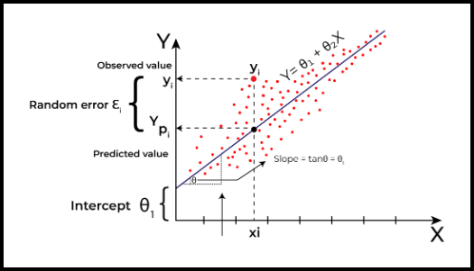
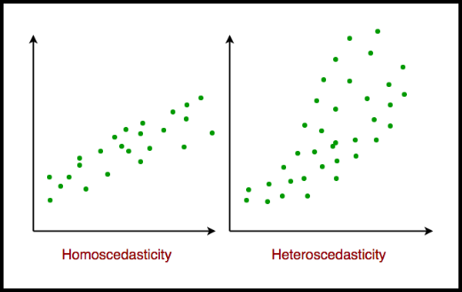

# Regresion lineal

## Definición

Es un algoritmo de *Aprendizaje Supervisado* que permite predecir un valor cuantitativo `Y` en función de una variable `X`, asumiendo que existe una relación lineal entre ambos.

Matemáticamente, se expresa de la siguiente manera;

> $Y \approx \beta_{0} + \beta_{1}X$

Siendo $\beta_{0}$ y $\beta_{1}$ coeficientes y parámetros del modelo. Mediante nuestra data (dataset) estimamos $\hat{\beta_{0}}$ y $\hat{\beta_{1}}$, obteniendo podemos predecir/estimar la variable objetivo `Y` de esta manera:

> $\hat{y} \approx \hat{\beta_{0}} + \hat{\beta_{1}}x$

Donde $\hat{y}$ representa una predicción de `Y` en función de `X = x`.

### Objetivo: best-fit line

> Fuente: [geeks-for-geek: linear regression](https://www.geeksforgeeks.org/ml-linear-regression/)

### Estimando los coeficientes

Nuestro objetivo se resume en estimar $\hat{\beta_{0}}$ y $\hat{\beta_{1}}$ de manera que el modelo lineal se ajuste a los datos de entrenamiento tal que:

> $y \approx \hat{\beta_{0}} + \hat{\beta_{1}}x_{i}$ &nbsp; $\forall i= 1, ...., n$

Es decir, los $\hat{\beta_{0}}$ y $\hat{\beta_{1}}$ que permitan que la recta resultante se aproxime lo más posible a nuestro datos.

Una manera de obtener esto es mediante ***Mínimos cuadrados***.

### Mínimos cuadrados

Al hablar de mínimos cuadrados, debemos considerar los residuos, es decir, la diferencia entre el valor real y el valor estimado:

> $e_{i} = y_{i} - \hat{y}_{i}$

que representa la diferencia el i-ésimo valor de y con el i-ésimo valor estimado para y ($\hat{y}$).

De esta manera, podemos definir the `RSS` o `Residual Sum of Squares`:

> $RSS = e_{1}^{2} + e_{2}^{2} + e_{3}^{2} + ... + e_{n}^{2}$

Que puede expresar también como:

> $RSS = (y_{1} - \hat{\beta_{0}} - \hat{\beta_{1}}x_{1})^{2} + (y_{2} - \hat{\beta_{0}} - \hat{\beta_{1}}x_{2})^{2} + ... + (y_{n} - \hat{\beta_{0}} - \hat{\beta_{1}}x_{n})^{2}$
> $\hat{\beta_{1}} = \frac{\sum_{i}^{n}(x_{i}-\bar{x})(y_{i}-\bar{y})}{\sum_{i}^{n}(x_{i}-\bar{x})^{2}}$
> $\hat{\beta_{0}} = \bar{y} - \hat{\beta_{1}}\bar{x}$

En donde

> $\bar{y} = \frac{1}{n}\sum_{i}^{n}y_{i}$
> $\bar{x} = \frac{1}{n}\sum_{i}^{n}x_{i}$

las ***medias*** de los datos.

### Expresión matricial

Si tuviesemos más de una variable predictora, nuestra aproximación se expresa de esta manera:

> $\hat{y} \approx \hat{\beta} + \hat{\omega_{0}}x_{0} + ... + \hat{\omega_{n}}x_{n}$

Matricialmente se expresa

> $\hat{y} \approx \hat{\beta} + W^{T}X$

## Supuestos

> Fuente: [geeks-for-geek: linear regression](https://www.geeksforgeeks.org/ml-linear-regression/)

1. Linealidad: la relación entre el input `X` y el output `Y` debe ser una línea recta
1. Independencia del error: los errores en nuestra predicciones no deben afectarse entre sí
1. Homocedasticidad: los errores deben tener una dispersión similar entre todas las variables de entrada
   1.1. 
1. Normalidad de errores: Los errores deben seguir (**should follow**) una distribución normal
1. NO multicolinealidad (para regresión multiple): las variables de entrada ***NO deben estar demasiado relacionadas entre sí***
1. No autocorrelación: los errores no deben seguir patrones repetitivos, en especial con time-based data.
1. Aditividad: El efecto total sobre Y es simplemente la suma de los efectos de cada X, sin mezcla ni interacción entre ellos.

## Méticas de evaluación para Regresión Lineal

> Fuente: [geeks-for-geek: linear regression](https://www.geeksforgeeks.org/ml-linear-regression/)

### Mean Square Error (MSE)

Calcula el promedio del cuadrado de la diferencias entre el valor real y el valor estimado de todos los par de datos.
Se eleva al cuadrado para evitar que las diferencias positivas y negativas se cancelen entre sí.

> $MSE = \frac{1}{n}\sum_{i=1}^{n}(y_{i} - \hat{y}_{i})^{2}$

- `n`: cantidad de *par* de datos
- $y_{i}$ es el valor real del i-ésimo par de datos
- $\hat{y}_{i}$ es la predicción/estimación del i-ésimo par de datos

`MSE`

- nos permite cuantificar la precisión de las predicciones de un modelo
- `sensible a outliers`, ya que los errores grandes contribuyen de manera significativa a la puntuación general

### Mean Absolute Error (MAE)

Mide el promedio del valor absoluto de la diferencia entre el valor real y el valor estimado. Se utiliza para medir la precisión (accuracy) del modelo.

> $MAE = \frac{1}{n}\sum_{i=1}^{n}|y_{i} - \hat{y}_{i}|$

- `n`: cantidad de *par* de datos
- $y_{i}$ es el valor real del i-ésimo par de datos
- $\hat{y}_{i}$ es la predicción/estimación del i-ésimo par de datos

`MAE`

- Un valor bajo de MAE indica una ***mejor performance del modelo***
- `No es sensible a outliers`, ya que considera el valor absoluto de las diferencias.

### Root Mean Squared Error (RMSE)

Describe qué tan bien los puntos de datos observados coinciden con los valores esperados, o el ajuste absoluto del modelo a los datos.

> $RMSE = \sqrt{\frac{RSS}{n}} = \sqrt{\frac{\sum_{i=2}^{n}(y_{i} - \hat{y}_i)^{2}}{n}}$

### Coefficient of Determination (R-Squared)

Indica que tanta varianza/variación el modelo puede explicar o capturar. Siempre se encuentra en el rango de 0 a 1.
A mayor R-squared, significa que el modelo matchea mejor la data.

> $R^{2} = 1 - (\frac{RSS}{TSS})$

- RSS o Residual Sum of Squares: mide la diferencia entre la salida real y la salida observada

> $RSS = \sum_{i=1}^{n}(y_{i} - b_{0} - b_{1}x_{1})^{2}$

- TSS o Total sum of Squares: La suma de los errores de los puntos de datos con respecto a la media de la variable de respuesta se conoce como suma total de cuadrados o TSS.

> $TSS = \sum_{i=1}^{n}(y - \bar{y}_{i})^{2}$

`RSS`

- Mide la proporción de variance in la variable dependiente que es explicada por las variables independientes del modelo.
- Se encuentra entre 0 y 1.
- A mayor valor, mejor modelo.

## Linear Model Selection and Regularization

> Todo esto sale del capítulo 6 `Linear Model Selection and Regularization` del libro ***Introduction to statistical learning***

